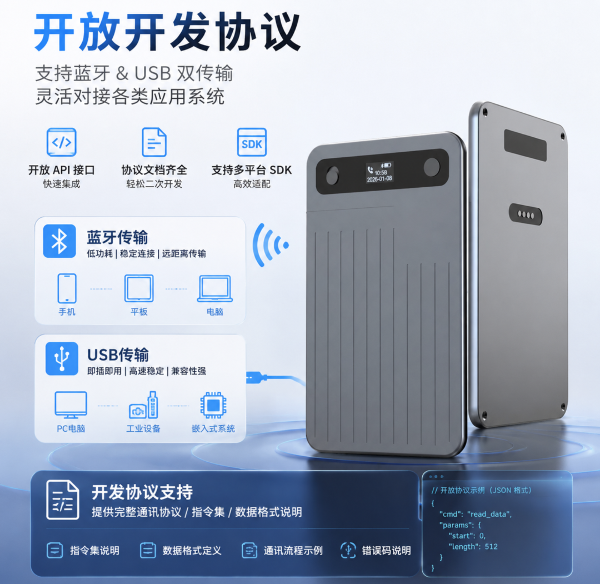

# 声云录音卡 Recorder

> 一张录音卡片，一套完整的 BLE 接入方案。

声云录音卡 Recorder 是面向硬件厂商、软件开发者和行业集成商的开源示例项目。我们以 **录音卡片硬件** 为核心产品，同时开放录音卡 BLE 通讯协议 SDK、跨平台接入示例和桌面端 Demo，帮助团队从“连接设备”快速走到“录音、传输、转写和业务落地”。



## 项目定位

本项目提供“标准 BLE 指令 + 厂商适配层 + 跨平台 SDK 封装”的录音硬件接入参考。录音卡负责采集和保存音频，SDK 负责 BLE 会话、协议收发、设备状态和数据流管理，应用负责业务 UI、音频解码、存储、转写及行业集成。杰理、蓝讯、炬芯、BK 等方案的服务 UUID、特征值、分包方式和私有命令差异收敛在适配层，应用开发者面向统一接口接入不同硬件。

本仓库提供四类资源：

| 资源 | 适用对象 | 内容 |
| --- | --- | --- |
| 移动端 SDK | Android、iOS、鸿蒙及 Flutter 开发者 | 平台封装、蓝牙搜索连接、录音控制、实时音频、文件传输、Wi-Fi、OTA、设备信息和事件回调 |
| Windows/macOS Demo | PC 应用和工具开发者 | Python BLE 协议实现、命令行 REPL、Web 控制台、离线语音转文字 |
| 协议与测试资料 | 需要深度定制的团队 | BLE GATT、帧格式、CRC、文件下载、录音事件和兼容策略 |
| 集成与方案文档 | 硬件方案商、App 团队和项目评审人员 | 三端 SDK 集成流程，以及标准 BLE 指令 SDK 的技术方案说明 |

## 能做什么

- 为 Android、iOS、HarmonyOS 和 Flutter 应用提供统一的扫描、连接、录音控制和设备事件入口
- 处理实体按键发起的开始、暂停、继续、停止请求，并由 App 确认后执行
- 接收 16 kHz、单声道、Opus 裸字节实时音频，交给应用自己的解码、播放、ASR 或会议纪要服务
- 获取录音文件列表，按文件名和 offset 分段下载、断点续传、校验、落盘和删除
- 获取电量、容量、固件版本、SN、授权码、录音状态、时长、增益等设备信息
- 通过 BLE 控制设备 Wi-Fi 热点，再以 Wi-Fi/TCP 传输录音文件或固件；纯 BLE 不承担 OTA 固件传输
- 在 Windows/macOS Demo 中完成扫描、连接、巡检、录音控制、文件下载、试听和转写验证
- 以标准命令和 VendorAdapter 适配新芯片、新型号及行业 App，减少硬件和应用的重复联调

## 目录导航

```text
recorder/
├── pnote-android-sdk/                  # Android AAR
├── pnote-ios-sdk/                      # iOS 静态库与头文件
├── pnote-harmony-sdk/                  # 鸿蒙 HAR SDK
├── pnote-sdk-flutter-demo-main/        # Flutter 联调 Demo
├── pnote-web-win&Mac-demo/             # BLE 命令行与 Web Demo
│   ├── recorder/                       # 协议、BLE、设备会话、ASR、Web 后端
│   ├── web/                            # 前端页面
│   ├── tests/                          # 协议与设备模拟测试
│   └── docs/协议.md                    # CB08 通讯协议 V1.0
├── img/                                  # 项目图片资源
│   ├── 录音卡片.png                       # 产品图片
│   ├── 硬件参数.png                       # 硬件参数图
│   └── 企业微信.png                       # 联系二维码
├── SDK 集成引导.docx                     # SDK 集成流程与平台接入引导
├── 声云专利交底书-标准BLE指令SDK方案.docx # 标准 BLE 指令 SDK 技术方案参考
├── demo.mp4                            # 演示视频
└── LICENSE                             # MIT License
```

## 五分钟运行桌面 Demo

需要 Python 3.10 以上、可用 BLE 适配器，以及一台处于可连接状态的录音卡。

```bash
cd pnote-web-win&Mac-demo
python -m venv .venv
source .venv/bin/activate                 # Windows PowerShell: .venv\\Scripts\\Activate.ps1
pip install -r requirements.txt
python main.py --web
```

浏览器打开 `http://127.0.0.1:8000`。命令行也可这样验证：

```text
record> scan
record> connect 0
record> smoke
record> list
record> download 0
record> transcribe 0
```

完整命令见 [桌面 Demo README](pnote-web-win%26Mac-demo/README.md)。离线转写和 Web 页面为可选能力：

```bash
pip install -r requirements-asr.txt
pip install -r requirements-web.txt
python -m unittest discover tests -v
```

首次转写会从 ModelScope 下载约 900 MB 模型，之后可离线运行。

### pnote-web-win&Mac-demo

桌面 Demo 位于 [`pnote-web-win&Mac-demo`](pnote-web-win%26Mac-demo/)，同时提供命令行 REPL 和浏览器 Web 控制台，可完成设备扫描、连接巡检、录音控制、文件下载、WAV 试听、实时推流和离线转写。


## 移动端接入

开始接入前，请先阅读 [SDK 集成引导（Word）](SDK%20%E9%9B%86%E6%88%90%E5%BC%95%E5%AF%BC.docx)，了解权限、依赖、初始化、回调、音频处理、文件续传和 OTA 验收流程；需要理解跨厂商标准化设计时，可参考 [标准 BLE 指令 SDK 技术方案](%E5%A3%B0%E4%BA%91%E4%B8%93%E5%88%A9%E4%BA%A4%E5%BA%95%E4%B9%A6-%E6%A0%87%E5%87%86BLE%E6%8C%87%E4%BB%A4SDK%E6%96%B9%E6%A1%88.docx)。

### Flutter 联调工程

```bash
cd pnote-sdk-flutter-demo-main
flutter pub get
flutter run
```

请使用真机验证蓝牙、录音、Wi-Fi 和 OTA。核心入口是 `lib/provider_record_pen.dart`，详见 [Flutter Demo README](pnote-sdk-flutter-demo-main/README.md)。

### Android

将 [Android AAR](pnote-android-sdk/pnote_20260728171001.aar) 复制到应用的 `app/libs`（或 `src/main/libs`），添加 `fileTree` 依赖及 SDK 所需的 RxJava、Retrofit、EventBus 等依赖，然后调用：

```java
PNote.init(context, deviceDataListener);
PNote.startSearch();
PNote.connectDevice(name, address);
```

回调包括 JSON 设备事件、实时录音 OPUS 数据和文件 OPUS 数据。完整接口见 [Android SDK 开发文档](pnote-sdk-flutter-demo-main/android%20SDK开发文档(最新版本)-2026.04.23.md)。

### iOS

将 [libPNote.a](pnote-ios-sdk/libPNote.a) 与 [PNode.h](pnote-ios-sdk/PNode.h) 加入 Xcode，实现 `WindBleDelegate`，调用 `startSearch`、`connectDeviceAndAddress` 等接口。完整接口和 OTA 流程见 [iOS SDK 开发文档](pnote-sdk-flutter-demo-main/iOS%20SDK开发文档(最新版本)-2026.04.23.md)。

### 鸿蒙

鸿蒙 SDK 以 [har_recordersdk.har](pnote-harmony-sdk/har_recordersdk.har) 提供，当前集成引导按 HarmonyOS API 12+ 编写。将 HAR 引入工程后，申请蓝牙权限并使用扫描回调中的 `deviceId` 连接；该 `deviceId` 可能是系统隐私随机标识，`address` 仅用于展示。业务结果均从 `DEVICE_DATA` 事件异步返回。

## 协议实现要点

- 分层结构：App/业务层 → SDK 核心与状态机 → 标准 BLE 协议层 → VendorAdapter 厂商适配层 → 硬件固件
- BLE GATT 参考：Service `0xAE20`；写特征 `AE21`；数据通知 `AE22`；按键通知 `AE23`
- 通用帧：`MAGIC(0x5A) + SEQ + CRC-16/XMODEM + LEN + TYPE/CMD/PARAMS`；按长度缓存、校验、去重、重组并关联请求应答
- 通知数据支持半帧、多帧、噪声和跨包重组；数据通知与按键通知使用独立解析缓存，发送端按 MTU 分片并保持帧内顺序
- 关键命令覆盖设备信息、电量容量、录音状态、文件列表/下载、时间同步、按键响应、Wi-Fi 状态、参数设置和 OTA 状态；未知命令应返回可识别错误
- 文件列表以 `finish=1` 或平台 SDK 的完成状态作为结束条件；下载使用 4 字节小端 `offset`，应用应校验文件大小和音频可解码性
- 实时录音和文件回调是 Opus 裸字节，基本参数为 16 kHz、单声道、40 字节/帧、20 ms；SDK 不负责解码或生成 WAV 头
- OTA 先由 BLE 完成模式和环境控制，再由 Wi-Fi/TCP 传输固件；升级前检查电量、版本和 TCP 状态，任一链路断开应停止任务并等待恢复

协议字段、命令表、真实抓包帧和兼容策略见 [docs/协议.md](pnote-web-win%26Mac-demo/docs/%E5%8D%8F%E8%AE%AE.md)。

## 集成建议

1. 先用桌面 Demo 对真实样机完成扫描、连接、时间同步、巡检和至少一个文件下载。
2. 移动端按目标系统申请蓝牙权限；初始化 SDK 后注册设备事件、实时录音和文件数据回调，再开始扫描。
3. 使用扫描事件返回的连接标识发起连接；连接成功后先同步时间，再读取电量、容量、版本和文件列表。
4. 把回调转换到应用自己的事件队列或状态管理层，方法调用只代表请求提交，业务完成以异步事件为准。
5. 音频按 40 字节 Opus 帧交给独立解码任务；文件按完成状态收尾、记录 offset，并校验大小和可解码性后再展示。
6. OTA 仅在 Wi-Fi/TCP 建链、版本需要更新且电量不低于 20% 时执行；升级中 BLE 或 Wi-Fi 断开都应标记失败，不要无条件重发完整固件。
7. 硬件新增芯片或型号时优先扩展 VendorAdapter、能力位和版本协商，不要让厂商私有字段渗透到 App 业务层。
8. 云端 ASR 密钥、设备授权码和真实录音不得硬编码或提交到仓库；日志和抓包应脱敏。

## 适用场景

适用于会议记录、采访采集、课堂培训、内容创作、巡检记录、智能硬件配套 App、企业礼赠录音设备，以及需要将杰理、蓝讯、炬芯、BK 等方案快速接入同一 App 的软硬件联合项目。硬件方案商可复用标准适配契约，应用团队可复用跨平台业务模型，双方共同扩展录音硬件产品生态。

## 硬件与商业合作

合作模式可按“硬件方案适配 + SDK 交付 + 项目服务”推进：方案商提供芯片能力、BLE 服务/特征和私有命令约束，声云在 VendorAdapter 中完成标准化映射；App 团队使用 Android、iOS、HarmonyOS 或 Flutter 接口完成业务集成。批量采购、样机验证、外观/固件定制、行业功能、云端转写和交付支持可按项目评估，具体 SDK 包、版本和授权范围以交付清单及商务协议为准。


如需获取硬件规格、样机、鸿蒙 SDK、协议完整版、企业微信二维码或技术支持资料，请联系 **安徽声云**（官网：[sinicloud.com](https://www.sinicloud.com/)）。咨询时请说明目标平台、预计数量和应用场景。

## 许可与使用边界

仓库示例代码以 [MIT License](LICENSE) 发布。AAR、静态库、HAR、固件、设备私有协议和部分文档可能包含声云或厂商专有内容，不等同于全部开源，具体使用、再分发和商用范围以随包说明及双方商务协议为准。接口字段、命令编号和行为以最新 SDK、固件、协议版本及真机联调结果为准；SDK 不替代应用侧的 Opus 解码、文件存储、权限管理或安全控制。请勿将私有协议用于未获授权的硬件或产品。

“标准 BLE 指令 SDK 技术方案”文档用于技术交底和方案沟通，不替代专利代理师的现有技术检索、权利要求布局或法律意见。

## 反馈与问题

提交问题时请附上操作系统与版本、目标平台、SDK/Demo 版本、设备固件版本、复现步骤，以及必要的日志或收发帧 hex。涉及真实设备数据时，请先脱敏序列号、地址、授权码和录音内容。
